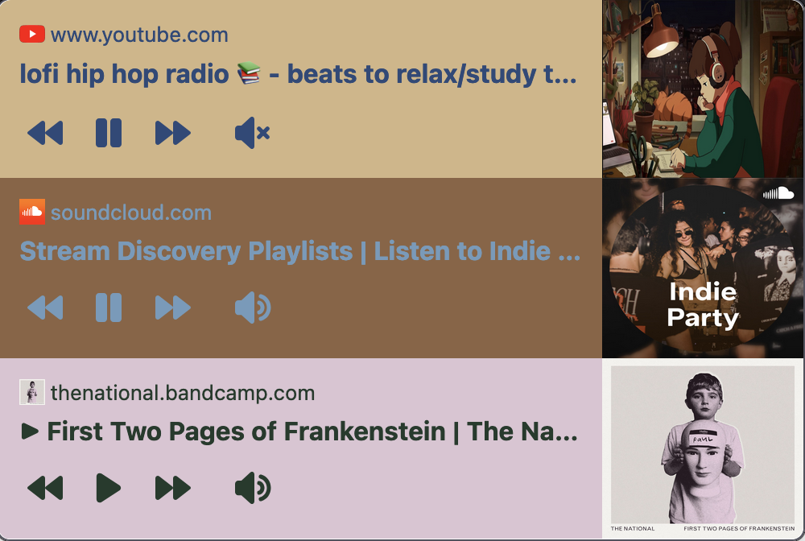

  

<h1 align="center">media-controller-extension</h1>

  
  

  

A Firefox browser extension that lets you globally control media playbacks across tabs in a
single place at the toolbar, similar to Chrome's [media control button](https://support.google.com/chrome/answer/9692215?hl=en).

> Inspired by [this](https://connect.mozilla.org/t5/ideas/media-control-button/idi-p/8544) thread on *connect.mozilla.org*.

Tested on *YouTube*, *SoundCloud*, *Twitch*, *Bandcamp* etc.

---

  <strong>~ crafted with ♥︎ by tnychn ~</strong>
   
  <strong>MIT © 2024 Tony Chan</strong>

